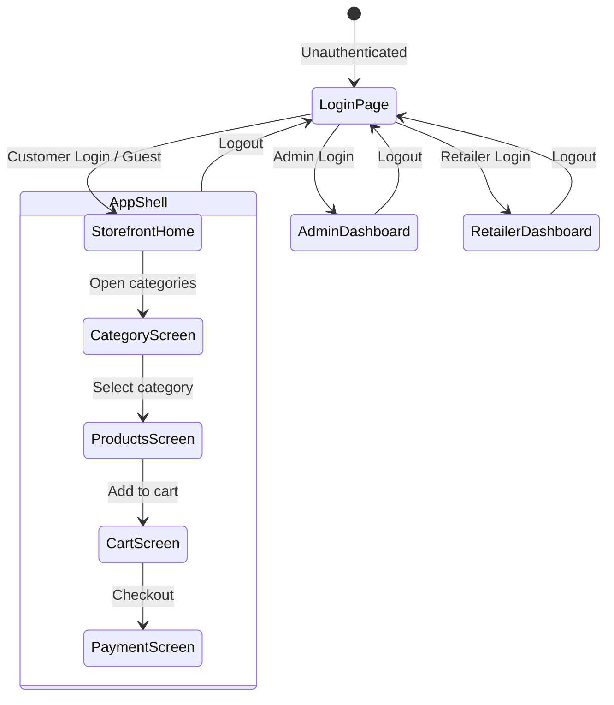

<div align="center">
  <h1>🛒 GroCart</h1>
  <p><strong>A Premium, High-Fidelity Grocery Delivery Web Dashboard</strong></p>

  <p>
    
    
    
    
    
    
  </p>

  <p>
    <a href="#-key-features">Features</a> •
    <a href="#-tech-stack">Tech Stack</a> •
    <a href="#-architecture">Architecture</a> •
    <a href="#-getting-started">Getting Started</a>
  </p>
</div>

---

GroCart offers a highly polished, responsive shopping experience backed by a robust **Clean Architecture**. It features role-based authentication (Admin, Retailer, and Customer), real-time weather integration, dynamic seasonal theme overlays, and seamless cart & order workflows.

## 🎥 Demo

*Watch GroCart in action below:*

<div align="center">
  <video src="grocart-demo.mp4" width="100%" controls style="border-radius: 10px; box-shadow: 0 4px 6px rgba(0, 0, 0, 0.1);"></video>
</div>

---

## ✨ Key Features

- 🔐 **Role-Based Authentication**: Secure login and dedicated dashboards for **Admins**, **Retailers**, and **Customers** using a robust `RoleGuard`.
- 🏗️ **Clean Architecture**: Domain-driven structure (Presentation, Domain, Infrastructure, Application) for enhanced scalability and maintainability.
- 🎨 **Modern UI/UX**: Beautiful layout with ivory/cream and soft gold design accents, fully optimized for mobile and desktop screens. Dynamic dark/light mode with curated palettes.
- ☁️ **Advanced Data Management**: Uses `@tanstack/react-query` and `axios` for optimal data fetching, with centralized global state via `@reduxjs/toolkit` and `redux-persist`.
- 📊 **Data Visualization**: Insightful analytics and charts in Admin and Retailer dashboards powered by `recharts`.
- 🌤️ **Dynamic Weather Themes**: Integrates Geolocation and the Open-Meteo API to dynamically change the seasonal background gradient and canvas animations based on local conditions.
- 🛒 **Smart Cart Syncing**: Optimistic updates and remote synchronization with Firebase Database for authenticated users, falling back to local storage for guests.
- 🚀 **Seamless Deployment**: Built-in support for GitHub Pages and Vercel with route rewrites and SPA fallback handling.

---

## 🛠️ Tech Stack

| Category | Technologies |
| :--- | :--- |
| **Core** | React 19, TypeScript 7.0, Vite 8 |
| **Styling** | Tailwind CSS 4, Lucide React Icons |
| **Routing & State** | React Router 8, Redux Toolkit 2, Redux Persist |
| **Data Fetching** | TanStack React Query, Axios |
| **Backend & Auth** | Firebase 12 (Authentication & Realtime Database) |
| **APIs** | OpenStreetMap Nominatim, Open-Meteo Weather Forecast |
| **Charts** | Recharts |

---

## 🏗️ Architecture

GroCart is organized into a modular, clean architecture to strictly separate business logic from UI and infrastructure:

- 📂 **`src/domain/`**: Core domain models, entities, and constants.
- 📂 **`src/application/`**: Application use cases, Redux slices, and custom hooks orchestrating domain logic.
- 📂 **`src/infrastructure/`**: External integrations, API clients, and Firebase configuration.
- 📂 **`src/presentation/`**: Visual UI components, pages, and route guards.
- 📂 **`Legacy Layers`**: Older `.jsx` screens and components, gradually being migrated to the presentation layer.

### 🔄 User Flow Diagram



---

## 🚀 Getting Started

Follow these steps to set up the project locally:

### 1. Clone & Install
```bash
git clone https://github.com/AdityaUpadhyay2610/grocart-webapp.git
cd grocart-webapp
npm install
```

### 2. Configure Environment
Copy the example environment file and add your Firebase configuration details:
```bash
cp .env.example .env
```

### 3. Start Development Server
```bash
npm run dev
```
Navigate to `http://localhost:5173` in your browser.

---

## 💻 Available Scripts

- `npm run dev` — Starts the local Vite development server with HMR.
- `npm run build` — Compiles and minifies the application for production deployment.
- `npm run preview` — Locally previews the built production bundle.
- `npm run lint` — Runs the Oxlint linter to ensure code quality.
- `npm run deploy` — Compiles the app and deploys it to GitHub Pages.

---

## 📝 Additional Notes

- **Location Services**: Relies on browser geolocation and OpenStreetMap reverse geocoding.
- **Weather Integration**: Queries Open-Meteo hourly to parse local outdoor conditions.
- **Data Persistence**: Cart state is synced to Firebase for authenticated users and stored in local storage for guest sessions. Address and custom avatars are saved locally.
- **Email Verification**: Fully supported for newly registered users.

<br />
<div align="center">
  <p>Built with ❤️ for a better shopping experience.</p>
</div>
