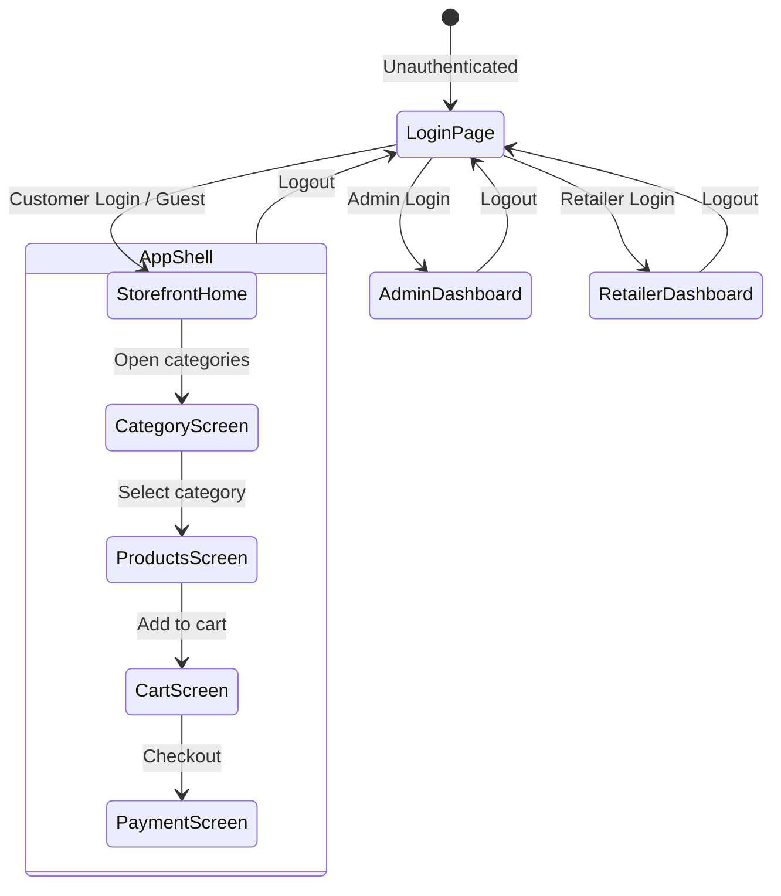

# GroCart 🛒

GroCart is a premium, high-fidelity grocery delivery web dashboard built with React 19, TypeScript, and Vite. It offers a highly polished, responsive shopping experience with a robust **Clean Architecture**, role-based authentication (Admin, Retailer, and Customer), real-time weather integration, dynamic seasonal theme overlays, and robust cart & order workflows.

---

## 🎥 Demo Video

Below is a demonstration of GroCart's interface and key features:

<video src="grocart-demo.mp4" width="100%" controls></video>

---

## 🌟 Key Features

* **Role-Based Authentication (New!)**: Secure login and dedicated dashboards for **Admins**, **Retailers**, and **Customers** using a robust `RoleGuard`.
* **TypeScript & Clean Architecture (New!)**: Transitioned to a domain-driven structure (Presentation, Domain, Infrastructure, Application) for enhanced scalability and maintainability.
* **Modern Grocery Shopping UI**: Beautiful layout with ivory/cream and soft gold design accents, fully optimized for mobile and desktop screens.
* **Advanced Data Fetching**: Utilizes `@tanstack/react-query` alongside `axios` for optimized data fetching, caching, and state synchronization.
* **State Management with Redux Toolkit**: Centralized global state using `@reduxjs/toolkit` and `redux-persist` for authentication status, guest session tracking, and cart operations.
* **Data Visualization**: Integrated `recharts` for insightful analytics in Admin and Retailer dashboards.
* **Dynamic, Weather-Aware Theme Overlays**: Geolocation is coupled with the Open-Meteo Weather API to dynamically change the seasonal background gradient and canvas animations based on local temperature and precipitation.
* **Cart Syncing & Persistence**: Uses optimistic updates and remote synchronization with Firebase Database for authenticated users, and automatically falls back to local storage persistence for guest users.
* **Theme Toggle**: Easy dark/light mode toggle with curated deep plum, amber, slate-indigo, and icy-blue dark-mode gradient equivalents.
* **GitHub Pages + Vercel deployment support** with route rewrites and SPA fallback handling.

---

## 🧩 Tech Stack

* **Core**: React 19, TypeScript 7.0, Vite 8
* **Styling**: Tailwind CSS 4, Lucide React Icons
* **Routing**: React Router 8
* **State & Data**: Redux Toolkit 2, Redux Persist, TanStack React Query, Axios
* **Charts**: Recharts
* **Backend Integration**: Firebase 12 (Auth & Database)
* **APIs**: OpenStreetMap Nominatim API, Open-Meteo Weather Forecast API

---

## 🚧 Clean Architecture Overview

GroCart is organized into a modular, clean architecture to separate business logic from UI and infrastructure:

* **`src/domain/`**
  * Core domain models, entities, and constants.
  * Examples: `models/index.ts`, `constants/index.ts`
* **`src/application/`**
  * Application use cases, Redux slices, and custom hooks orchestrating domain logic.
  * Examples: `store/authSlice.ts`, `hooks/useAppHooks.ts`, `hooks/useRetailer.ts`
* **`src/infrastructure/`**
  * External integrations, API clients, and Firebase configuration.
  * Examples: `api/appApis.ts`, `http/axiosInstance.ts`, `firebase/firebaseConfig.ts`
* **`src/presentation/`**
  * Visual UI components, pages, and route guards.
  * Examples: `pages/AdminDashboard.tsx`, `pages/RetailerDashboard.tsx`, `pages/StorefrontHome.tsx`, `components/RoleGuard.tsx`
* **Legacy Layers**
  * Existing `.jsx` screens and components (e.g. `src/screens`, `src/components`) are co-located as they are gradually migrated to the presentation layer.

### Role-Based Flow



---

## 🚀 Getting Started

1. **Install dependencies**:
   ```bash
   npm install
   ```
2. **Configure Environment Variables**:
   Copy the example environment file to `.env` and fill in your Firebase configuration details:
   ```bash
   cp .env.example .env
   ```
3. **Start the development server**:
   ```bash
   npm run dev
   ```
4. Open the app in your browser at `http://localhost:5173`.

---

## 🛠️ Available Scripts

In the project directory, you can run:

* `npm run dev` — Starts the local Vite development server with hot-module replacement.
* `npm run build` — Compiles and minifies the application for production deployment.
* `npm run preview` — Locally previews the built production bundle.
* `npm run lint` — Runs the Oxlint linter.
* `npm run deploy` — Compiles the app and deploys it to GitHub Pages.

---

## 💡 Notes

* Location uses browser geolocation and OpenStreetMap reverse geocoding.
* Weather integration queries Open-Meteo hourly updates to parse local outdoor conditions.
* Cart state is synced to Firebase for authenticated users and stored in local storage for guest sessions.
* Address and user customization assets (such as custom avatar emoji) are saved locally in `localStorage`.
* Email verification is supported for registered users.
