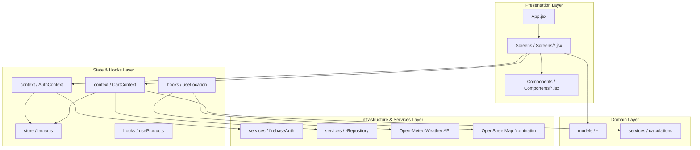
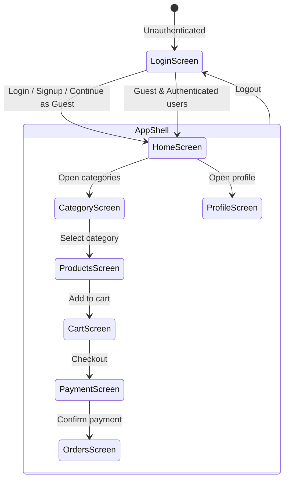

# GroCart 🛒

GroCart is a premium, high-fidelity grocery delivery web dashboard built with React and Vite. It offers a highly polished, responsive shopping experience with client-side routing, user authentication, location-aware services, real-time weather integration, dynamic seasonal theme overlays, and robust cart & order workflows.

---

## 🌟 Key Features

* **Modern Grocery Shopping UI**: Beautiful layout with ivory/cream and soft gold design accents, optimized for both desktop sidebars and mobile bottombar controls.
* **Protected & Guest Routing**: Seamless session redirection, route protection, and support for guest user checkout.
* **State Management with Redux Toolkit**: Centralized global state using `@reduxjs/toolkit` and `react-redux` for authentication status, guest session tracking, and cart operations.
* **Dynamic, Weather-Aware Theme Overlays**: Geolocation is coupled with the Open-Meteo Weather API to dynamically change the seasonal background gradient and canvas animations based on local temperature and precipitation (Winter, Monsoon, Summer, Spring, Autumn).
* **Extreme Heatwaves Effect**: Activates floating heat/dust particles with blended orange and yellow glow when the local temperature exceeds 35°C in summer.
* **Header Weather Widget**: Integrates a real-time weather widget in the header displaying current temperature and dynamic animated weather state icons (Sun, Cloud, CloudRain, CloudSnow).
* **Product Detail Modal**: High-fidelity overlay showing category-tailored product descriptions, sourced location badges, ingredients, and nutrition facts.
* **Cart Syncing & Persistence**: Uses optimistic updates and remote synchronization with Firebase Database for authenticated users, and automatically falls back to local storage persistence (`grocart_guest_cart`) for guest users.
* **Order Placement & Simulated Tracking**: Fully functional checkout flow with order history, step-by-step live delivery progress tracker, and a disclaimer warning popup.
* **Printable Web Invoice Generator**: Generates a narrow receipt-style popup window with print styling, itemized breakdowns, total payment details, discounts, etc., allowing users to download or print invoice PDFs.
* **Theme Toggle**: Easy dark/light mode toggle with curated deep plum, amber, slate-indigo, and icy-blue dark-mode gradient equivalents.
* **GitHub Pages + Vercel deployment support** with route rewrites and SPA fallback handling.

---

## 🧩 What This App Uses

* React 19
* Vite 8
* Tailwind CSS 4
* React Router 8
* Firebase 12
* Redux Toolkit 2 (`@reduxjs/toolkit` & `react-redux`)
* Lucide React Icons
* OpenStreetMap Nominatim API (Reverse Geocoding)
* Open-Meteo Weather Forecast API
* `gh-pages` for GitHub Pages deployment

---

## 🚧 Architecture Overview

GroCart is organized into clean, modular layers:

* **`src/store/`**
  * Central Redux Toolkit store and slices
  * Examples: `index.js`, `authSlice.js`, `cartSlice.js`
* **`src/context/`**
  * Compatibility contexts wrapping Redux actions and selectors to preserve existing API signatures
  * Examples: `AuthContext.jsx`, `CartContext.jsx`
* **`src/hooks/`**
  * Custom UI hooks interfacing with data APIs and device sensors
  * Examples: `useLocation.js`, `useProducts.js`, `useOrders.js`
* **`src/services/`**
  * Data access repositories, Firebase config, and calculations
  * Examples: `firebaseAuth.js`, `calculations.js`, `cartRepository.js`, `productRepository.js`, `orderRepository.js`
* **`src/models/`**
  * Core domain entities and category maps
  * Examples: `User.js`, `Product.js`, `Order.js`, `Categories.js`, `CartItem.js`
* **`src/screens/`**
  * High-level views that compose UI layouts
  * Examples: `HomeScreen.jsx`, `ProductsScreen.jsx`, `CartScreen.jsx`, `OrdersScreen.jsx`, `PaymentScreen.jsx`, `ProfileScreen.jsx`
* **`src/components/`**
  * Visual UI widgets, models, sidebars, and overlays
  * Examples: `Sidebar.jsx`, `SeasonalOverlay.jsx`, `ProductDetailModal.jsx`

### Architecture Flow



---

## 🔄 User Journey & Route Flow



---

## 🗺️ Navigation Summary

* `/login` — authentication page for login and signup.
* `/home` — landing dashboard with promotions and featured categories.
* `/categories` — category discovery screen.
* `/categories/:categoryId` — category-specific product listings.
* `/cart` — cart review and checkout initiation.
* `/orders` — past order history and order confirmation.
* `/profile` — user profile and saved address management.

---

## 📦 Deployment Support

### Vercel
* `vercel.json` rewrites all requests to `index.html` so the SPA correctly handles subroutes.
* Deploy by connecting the repo to Vercel and using default Vite build settings.

### GitHub Pages
* Build command uses `vite build --base=/grocart-webapp/`.
* The deploy script copies `dist/index.html` to `dist/404.html` so refreshes still load the app.
* Run:
  ```bash
  npm run predeploy
  npm run deploy
  ```

---

## 🚀 Getting Started

1. **Install dependencies**:
   ```bash
   npm install
   ```
2. **Configure Environment Variables**:
   Copy the example environment file to `.env` and fill in your Firebase configuration details:
   ```bash
   cp .env.example .env
   ```
3. **Start the development server**:
   ```bash
   npm run dev
   ```
4. Open the app in your browser at `http://localhost:5173`.

---

## 🛠️ Available Scripts

In the project directory, you can run:

* `npm run dev` — Starts the local Vite development server with hot-module replacement.
* `npm run build` — Compiles and minifies the application for production deployment.
* `npm run preview` — Locally previews the built production bundle.
* `npm run deploy` — Compiles the app and deploys it to GitHub Pages.

---

## 💡 Notes

* Location uses browser geolocation and OpenStreetMap reverse geocoding.
* Weather integration queries Open-Meteo hourly updates to parse local outdoor conditions.
* Cart state is synced to Firebase for authenticated users and stored in local storage for guest sessions.
* Address and user customization assets (such as custom avatar emoji) are saved locally in `localStorage`.
* Email verification is supported for registered users.

---

## 📁 Relevant Files

* [App.jsx](file:///d:/All%20Project/grocart-web/src/App.jsx) — main router, layout, search, and screen orchestration.
* [AuthContext.jsx](file:///d:/All%20Project/grocart-web/src/context/AuthContext.jsx) — Redux-bridged authentication wrapper.
* [CartContext.jsx](file:///d:/All%20Project/grocart-web/src/context/CartContext.jsx) — Redux-bridged cart and payment orchestration wrapper.
* [useLocation.js](file:///d:/All%20Project/grocart-web/src/hooks/useLocation.js) — geolocation, reverse geocoding, and Open-Meteo weather fetcher.
* [useProducts.js](file:///d:/All%20Project/grocart-web/src/hooks/useProducts.js) — product fetch and loading states.
* [firebaseAuth.js](file:///d:/All%20Project/grocart-web/src/services/firebaseAuth.js) — Firebase auth API wrappers.
* [Sidebar.jsx](file:///d:/All%20Project/grocart-web/src/components/Sidebar.jsx) — responsive sidebar (desktop) and mobile bottombar widget.
* [SeasonalOverlay.jsx](file:///d:/All%20Project/grocart-web/src/components/SeasonalOverlay.jsx) — weather-aware canvas particle background animator.
* [ProductDetailModal.jsx](file:///d:/All%20Project/grocart-web/src/components/ProductDetailModal.jsx) — category-aware product descriptions and nutritional specs modal overlay.
* [store/index.js](file:///d:/All%20Project/grocart-web/src/store/index.js) — centralized Redux Toolkit store.
