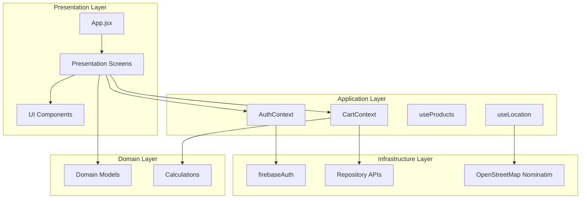
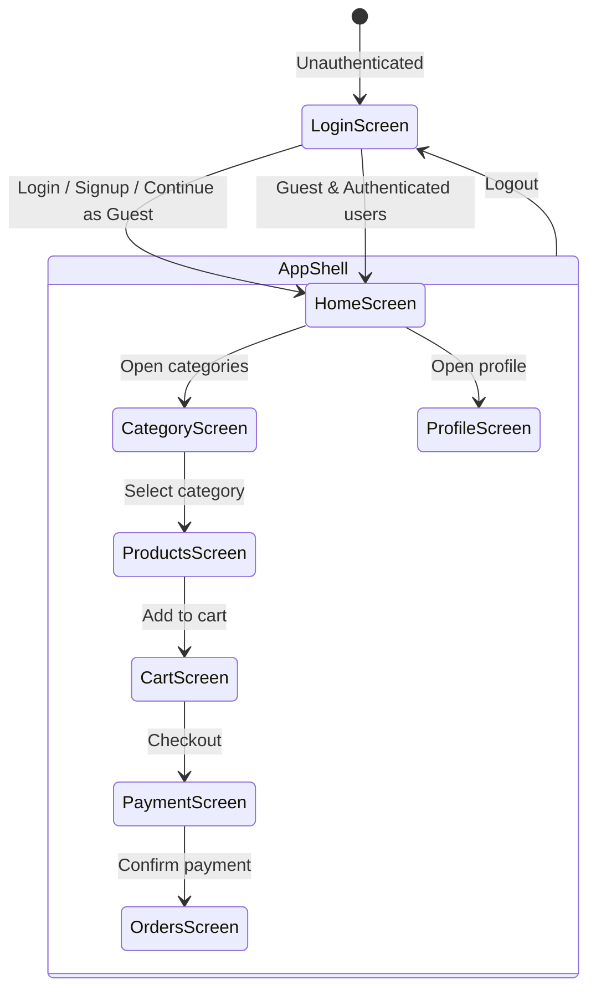

# GroCart 🛒

GroCart is a premium grocery delivery web dashboard built with React and Vite. It offers a polished shopping experience with route-based navigation, user authentication, cart management, animation-rich UI, location-aware delivery, and a fully responsive layout.

---

## 🌟 Key Features

* **Modern grocery shopping UI** with ivory/cream and soft gold design accents.
* **Responsive navigation**: desktop sidebar plus mobile-friendly controls.
* **Protected routing** with guest session support and login/registration flows.
* **Nested client-side routes** for categories and product browsing.
* **Search-as-you-type suggestions** across product names and categories.
* **Live geolocation reverse geocoding** using OpenStreetMap Nominatim.
* **Firebase Authentication** for user sign-in, signup, logout, email verification, and profile updates.
* **Cart management** with quantity controls, optimistic updates, and remote sync.
* **Order placement flow** with payment overlay and order history storage.
* **Seasonal overlay animations** that update based on active category context.
* **Theme toggle** for light/dark styling.
* **GitHub Pages + Vercel deployment support** with route rewrites and SPA fallback handling.

---

## 🧩 What This App Uses

* React 19
* Vite 8
* Tailwind CSS 4
* React Router 8
* Firebase 12
* Lucide React icons
* OpenStreetMap Nominatim API
* `gh-pages` for GitHub Pages deployment
* `oxlint` for linting
* PostCSS + Autoprefixer

---

## 🚧 Architecture Overview

GroCart is organized in a layered structure:

* `src/domain/`
  * business models and helper services
  * examples: `User.js`, `Product.js`, `Order.js`, `Categories.js`, `CartItem.js`
* `src/application/`
  * state, hooks, and contexts
  * `AuthContext.jsx`, `CartContext.jsx`, `useProducts.js`, `useLocation.js`
* `src/infrastructure/`
  * data access and integrations
  * `firebaseAuth.js`, `productRepository.js`, `orderRepository.js`, `cartRepository.js`
* `src/presentation/`
  * UI screens and reusable components
  * `HomeScreen.jsx`, `ProductsScreen.jsx`, `Sidebar.jsx`, `SeasonalOverlay.jsx`

### Architecture Flow



---

## 🔄 User Journey & Route Flow



---

## 🗺️ Navigation Summary

* `/login` — authentication page for login and signup.
* `/home` — landing dashboard with promotions and featured categories.
* `/categories` — category discovery screen.
* `/categories/:categoryId` — category-specific product listings.
* `/cart` — cart review and checkout initiation.
* `/orders` — past order history and order confirmation.
* `/profile` — user profile and saved address management.

---

## 📦 Deployment Support

### Vercel
* `vercel.json` rewrites all requests to `index.html` so the SPA correctly handles subroutes.
* Deploy by connecting the repo to Vercel and using default Vite build settings.

### GitHub Pages
* Build command uses `vite build --base=/grocart-webapp/`.
* The deploy script copies `dist/index.html` to `dist/404.html` so refreshes still load the app.
* Run:
  ```bash
  npm run predeploy
  npm run deploy
  ```

---

## 🚀 Getting Started

1. Install dependencies:
   ```bash
   npm install
   ```
2. Start the development server:
   ```bash
   npm run dev
   ```
3. Open the app in the browser at `http://localhost:5173`.

---

## 💡 Notes

* Location uses browser geolocation and OpenStreetMap reverse geocoding.
* Cart state is synced to Firebase for authenticated users.
* Address is saved locally in `localStorage`.
* Email verification is supported for registered users.

---

## 📁 Relevant Files

* `src/App.jsx` — main router, layout, search, and screen orchestration.
* `src/application/context/AuthContext.jsx` — authentication state and session logic.
* `src/application/context/CartContext.jsx` — cart state, order placement, and payment flow.
* `src/application/hooks/useLocation.js` — geolocation and reverse geocoding.
* `src/application/hooks/useProducts.js` — product fetch and loading states.
* `src/infrastructure/auth/firebaseAuth.js` — Firebase auth wrappers.
* `src/presentation/components/Sidebar.jsx` — navigation UI.
* `src/presentation/components/SeasonalOverlay.jsx` — seasonal animation effects.
