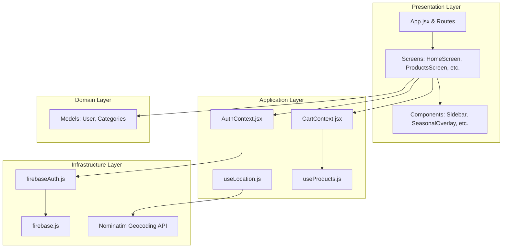
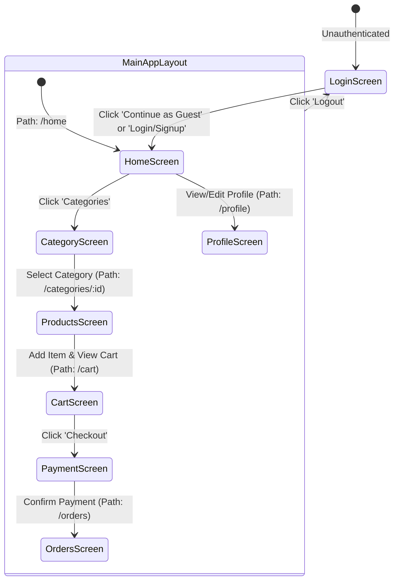

# GroCart 🛒

GroCart is an aesthetic, ultra-fast grocery delivery web dashboard. The application features a highly responsive layout, a dynamic cream/warm-gold theme, real-time GPS reverse-geocoding, seasonal animations, and nested client-side routing.

---

## 🌟 Key Features

* **Aesthetic Sidebar Navigation**: Designed with a premium ivory/cream and gold styling, featuring serialized index numbers, active state vertical indicator bars, and theme toggling.
* **Nested Client-Side Routing**: Implemented using `react-router` v7 to ensure smooth view transitions and clean browser path updates (e.g. `/home`, `/categories`, `/categories/:categoryId`, `/cart`, etc.).
* **Dynamic Content Screens**:
  * **Home Screen**: Interactive promo banners, horizontal recommendations slider, and category cards.
  * **Categories Screen**: Visual category grids for direct route navigation.
  * **Products Screen**: Real-time product listings filtered by route parameter with local "add-to-cart" flying animations.
  * **Cart Screen**: Item quantity adjustment, live subtotal/tax summary calculations, and checkout portals.
  * **Payment Screen**: Secured mock payment portal overlay.
  * **Orders Screen**: Track past receipts and orders history.
  * **Profile Screen**: User delivery address management synced with LocalStorage.
* **Authentication and Guarded Sessions**: Integrated with Firebase Authentication, supporting email validation, account signup/signin, and fully functional Temporary Guest browsing.
* **Predictive Search Bar**: Search matching suggestions updated in real time across the home and item list pages.
* **GPS Address Reverse-Geocoding**: Utilizes the OpenStreetMap Nominatim reverse-geocoding API to dynamically locate the user's physical delivery coordinates.
* **Aesthetic Seasonal Overlay**: Floating animations (snow, leaves, etc.) depending on active item categories.
* **Optimized Bundling**: Configured manual vendor chunking and custom route redirections for seamless deployment to both GitHub Pages and Vercel.

---

## 🛠️ Tech Stack & Tools

* **Core**: React 19, JavaScript (ES6+), Vite 8 (with Rolldown compiler).
* **Routing**: React Router v7.
* **Styling**: Tailwind CSS v4, Lucide React icons.
* **Backend**: Firebase v12 (Authentication).
* **API Integration**: OpenStreetMap Nominatim API.
* **Deployment**: `gh-pages` deployment module (GitHub Pages), Vercel Routing Configuration (`vercel.json`).

---

## 📐 Architecture & Structure

GroCart adheres to a clean, layered architectural pattern:

* **Domain Layer (`src/domain/`)**: Holds business models (e.g., `User`, `Categories`) and core helper functions.
* **Application Layer (`src/application/`)**: Manages business logic via custom hooks (e.g., GPS geolocator hook `useLocation`, products client `useProducts`) and React Contexts (e.g., `AuthContext`, `CartContext`).
* **Infrastructure Layer (`src/infrastructure/`)**: Standard client API connections, such as the Firebase initialization and authorization services.
* **Presentation Layer (`src/presentation/`)**: Responsive visual layouts, screens (e.g., `HomeScreen`, `ProductsScreen`), and UI components (`Sidebar`, `SeasonalOverlay`).

### Layer Dependencies


---

## 🔄 User Navigation & Routing Flow



---

## 🚀 Live Deployment Guide

The codebase is pre-configured to build and deploy to both Vercel and GitHub Pages.

### A. Deploying to Vercel
Vercel hosts single-page apps from the domain root (default configuration):
1. Import the repository into your Vercel Dashboard.
2. The included `vercel.json` file handles all subroute rewrites automatically.
3. Deploy!

### B. Deploying to GitHub Pages
GitHub Pages hosts projects in subfolders (e.g., `/grocart-webapp/`).
1. Install `gh-pages` as a dev dependency (pre-configured):
   ```bash
   npm install gh-pages --save-dev
   ```
2. Build and publish your assets automatically:
   ```bash
   npm run deploy
   ```
   *This executes a specialized build command (`vite build --base=/grocart-webapp/`) and duplicates the compilation index to `404.html` so subroutes load correctly on refreshes.*
